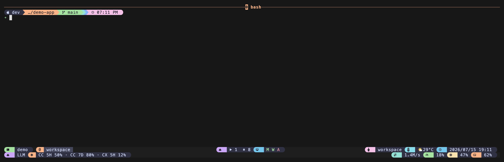

# tmux-llm-usage

> 中文說明請見 [docs/zh.md](docs/zh.md)

**A status-line capsule for your AI / LLM usage — bring your own data source.**

*Works on macOS and Linux.* Needs [`jq`](https://jqlang.github.io/jq/) and a
POSIX shell. Built and tested on macOS with tmux `next-3.8`; the plugin is plain
`sh` + `jq`, so it runs anywhere tmux does. (Minimum tmux **1.8** — see
[Requirements](#requirements).)

This is one of a three-part "AI tmux" family. The other two show what your
agents are *doing*; this one shows what your usage / quota / spend looks like.

## What is this?

Everybody's usage numbers live somewhere different — a Claude Code 5-hour quota,
a self-hosted LiteLLM spend total, an API metering dashboard, a homemade script.
There is no single number this plugin could scrape for you, so **it doesn't try
to.** Instead it gives you two things:

1. **A tiny contract.** You point it at *any command you write* that prints a
   little JSON (`{"v":1,"segments":[{"label":"CC 5H","value":"50%"}]}`).
2. **A pretty, non-blocking status segment.** The plugin runs your command in
   the background on a timer, caches the result, and renders it into your tmux
   status bar. Your bar never freezes, even if your command is slow or offline —
   it just keeps showing the last good value.

So the plugin is a **framework + a provider contract**, not a scraper. You wire
in *your* numbers once; it makes them look good and keeps them fresh.

Not sure where to start? The [Quickstart](#quickstart) uses a canned example so
you can see it working in about 30 seconds, then you swap in your real data.

## Requirements

- **tmux 1.8 or newer.** The plugin only uses very old, very stable tmux
  features: user options (`@…`), the `-g`/`-q`/`-v` flags on
  `show-option`/`set-option`, a status-line `#()` command, and
  `display-message`. Per the official
  [CHANGES](https://github.com/tmux/tmux/blob/master/CHANGES), `@` user options
  and the `-q` quiet flag both arrived in tmux **1.8** (26 Mar 2013); the `-v`
  value-only flag is present in that same release (tmux 1.8's `show-options`
  accepts `-gqv` — its arg spec is `gqst:vw`). That is the real floor. Tested on
  tmux `next-3.8` — a recent build's generous defaults can hide a missing flag,
  so the floor was checked against the 1.8 source, not this machine's tmux.
- **`jq`** on your `PATH` (`brew install jq`, `apt-get install jq`). It is used
  to parse the provider's JSON. If `jq` is missing the plugin tells you once and
  shows nothing.

## Quickstart

> New to tmux plugins? **`prefix`** means your tmux prefix key — by default
> that is **`Ctrl-b`** (hold Ctrl, press b, release both, then press the next
> key). If you changed it to `Ctrl-a`, use that instead.

You need three things: install the plugin, tell it where the `#{llm_usage}`
capsule should sit in your status line, and give it a provider command.

### With TPM (the tmux plugin manager) — recommended

1. If you have never used TPM, install it once:

   ```sh
   git clone https://github.com/tmux-plugins/tpm ~/.tmux/plugins/tpm
   ```

2. Add these lines to `~/.tmux.conf` (the `run '~/.tmux/plugins/tpm/tpm'` line
   must be the **last** line of the file):

   ```tmux
   # Where the usage capsule appears — drop #{llm_usage} anywhere in your status:
   set -g status-right "#{llm_usage} | %H:%M"

   # The provider: ANY command that prints usage JSON. Start with the demo:
   set -g @llm-usage-provider "~/.tmux/plugins/tmux-llm-usage/examples/static.sh"

   set -g @plugin 'operonlab/tmux-llm-usage'
   run '~/.tmux/plugins/tpm/tpm'
   ```

3. Reload the config and install the plugin:

   ```sh
   tmux source-file ~/.tmux.conf     # reload
   ```

   then press **`prefix` + I** (capital I) to fetch the plugin. You should now
   see `CC 5H 50% · CC 7D 80% · CX 5H 12%` in your status bar. 🎉

   Swap `static.sh` for `examples/litellm.sh`, `examples/ccusage.sh`, or your own
   script to show real numbers.

### Without TPM (plain `run-shell`)

Clone the repo and source the entry point directly from `~/.tmux.conf`:

```sh
git clone https://github.com/operonlab/tmux-llm-usage ~/.tmux/plugins/tmux-llm-usage
```

```tmux
set -g status-right "#{llm_usage} | %H:%M"
set -g @llm-usage-provider "~/.tmux/plugins/tmux-llm-usage/examples/static.sh"
run-shell '~/.tmux/plugins/tmux-llm-usage/llm-usage.tmux'
```

Then reload: `tmux source-file ~/.tmux.conf`.

## Demo



The capsule above is the bundled `examples/static.sh` provider; your
`status-right` gains a segment like:

```
CC 5H 50% · CC 7D 80% · CX 5H 12%
```

## The provider (this option runs your code)

> ⚠️ **`@llm-usage-provider` runs a shell command.** Only set it in a
> `tmux.conf` you trust — the same trust you already place in every other line
> of your config. The plugin executes whatever string you give it (via
> `sh -c`) on the refresh timer. Never point it at a command built from
> untrusted input.

A **provider** is any command whose standard output is one JSON object:

```json
{ "v": 1, "segments": [ { "label": "CC 5H", "value": "50%" } ] }
```

- `v` is the contract version (`1`). A missing `v` is treated as `1`.
- `segments` is an ordered list of `{ "label", "value" }` pairs. Only the first
  `@llm-usage-max-segments` are shown.
- Print nothing / exit non-zero / print broken JSON, and the capsule simply
  keeps its last good value — it never shows an error in your status bar.

See [docs/provider-contract.md](docs/provider-contract.md) for the full spec,
and [`examples/`](examples/) for three ready-to-adapt templates
(`static.sh`, `litellm.sh`, `ccusage.sh`). **Keep any endpoints and API keys in
environment variables — never hard-code a secret into a provider file.**

## Options

Set these in `~/.tmux.conf` **before** the `run`/`run-shell` line. Reload with
`tmux source-file ~/.tmux.conf` after changing them.

| Option | Default | Description |
|---|---|---|
| `@llm-usage-provider` | *(none — required)* | Command whose stdout is contract-v1 JSON. **Runs code** — see the warning above. Unset ⇒ capsule is empty and you get a one-time hint. |
| `@llm-usage-interval` | `60` | Seconds between background refreshes. The status bar itself still updates every `status-interval`; this only limits how often your provider actually runs. |
| `@llm-usage-format` | `label value` | Per-segment template. The words `label` and `value` are replaced by that segment's data. Try `[label:value]` or `#[fg=green]label#[default] value`. |
| `@llm-usage-max-segments` | `4` | Show at most this many segments (keeps the bar tidy). |
| `@llm-usage-timeout` | `10` | Seconds a single provider run may take before it is killed and the last value is kept. |

The capsule appears wherever you put the literal token **`#{llm_usage}`** in
`status-left` or `status-right`. No token, nothing shown.

## Uninstall

```sh
tmux run-shell ~/.tmux/plugins/tmux-llm-usage/scripts/teardown.sh
```

Then remove the `@plugin` / `set`/`run` lines from `~/.tmux.conf`. Teardown puts
the `#{llm_usage}` token back into your status line and deletes the cache
directory; it is safe to run more than once.

## Troubleshooting / FAQ

**I see nothing in my status bar.**
Three usual causes: (1) you didn't put `#{llm_usage}` in `status-left` or
`status-right`; (2) `@llm-usage-provider` is unset — the plugin shows a hint at
load time; or (3) the very first render happens *before* the first background
refresh finishes, so the capsule is briefly empty. Wait one `status-interval`
(or run `scripts/usage.sh __sync__` once to prime the cache).

**It says "jq not found".**
Install jq (`brew install jq` / `apt-get install jq`) and reload. The plugin
needs jq to parse your provider's JSON.

**My numbers are stale / don't update.**
The provider only re-runs every `@llm-usage-interval` seconds (default 60). If
your provider is failing, the plugin *deliberately* keeps the last good value
rather than flashing an error — run your provider command by hand in a shell to
see what it prints. It must be valid JSON on **stdout** (send logs to stderr).

**My status bar used to freeze with `#(…)` scripts. Will this?**
No. The `#()` here only reads a cached file and returns instantly; the actual
provider runs in a fully detached background process. Even a hung provider can't
block the bar — see [docs/provider-contract.md](docs/provider-contract.md).

**Does it work over SSH / in nested tmux?**
Yes — it's just a status-line segment. It reads no remote state; your provider
decides where the numbers come from.

## Credits & License

Part of a three-plugin "AI tmux" family. The non-blocking cache pattern is the
same one used by the family's `agent-status` capsule (read cache in the
foreground, refresh fully-detached in the background, never block the bar).

MIT — see [LICENSE](LICENSE).
